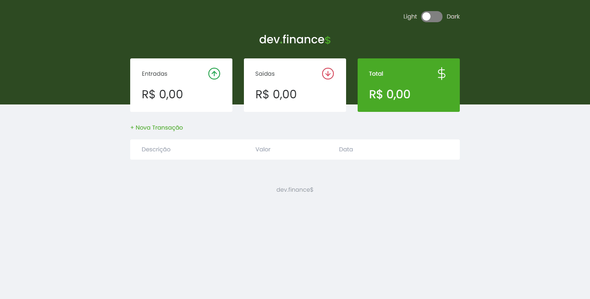
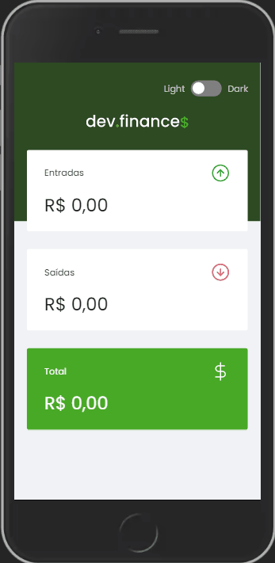

<h1 align="center">
  
<h1/>

  <a href="#-tecnologies">Tecnologies</a>&nbsp;&nbsp;&nbsp;|&nbsp;&nbsp;&nbsp;
  <a href="#-project">Project</a>&nbsp;&nbsp;&nbsp;|&nbsp;&nbsp;&nbsp;
  <a href="#-layout">Layout</a>&nbsp;&nbsp;&nbsp;|&nbsp;&nbsp;&nbsp;
  <a href="#memo-license">License</a>

 

  

 

 
  
  

## 🚀 Tecnologies

This project was developed with the following technologies

- HTML
- CSS
- JavaScript

## 💻 Project
Dev.finances was a financial control application developed by <a href="https://rocketseat.com.br/" target="_blank">Rocketseat </a> in an online event, where it is possible to register and delete transactions in addition to viewing the balance of inflows and outflows 💰

## 🎯 Extra Mile

- Transition effect on sessions to smooth the layout

- Customization of the process of adding a new transaction, displaying modal with error or success message in their respective colors, in addition to changing the border of the input representing error if there is no field to fill, or success if a part of the form is filled but still missing fields
- Change the color of the total card, if its value becomes negative
- I added and created the button function to change the application's theme to white or dark

## 🔖 Layout

You can view the layout of the project through [this link](https://www.figma.com/file/7Vu9DzUaCZIV4nibzkjgB4/dev.finance%24-Maratona-Discover). Account is required [Figma](https://figma.com) to access it.

## :memo: License

This project is under the MIT license. See the [LICENSE](LICENSE.md) file  for more details.

Developed by Ewerton Bernardo :wave: [Let's connect!](https://www.linkedin.com/in/ewertonbn/)
